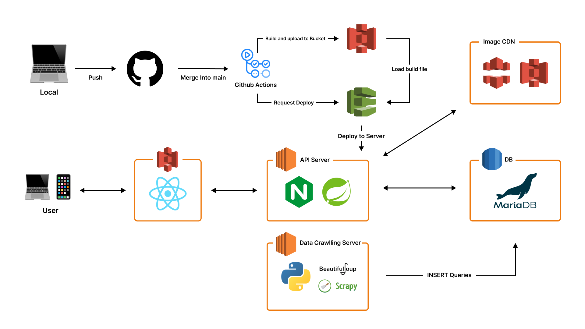
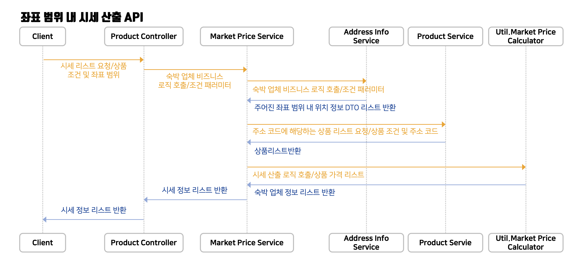
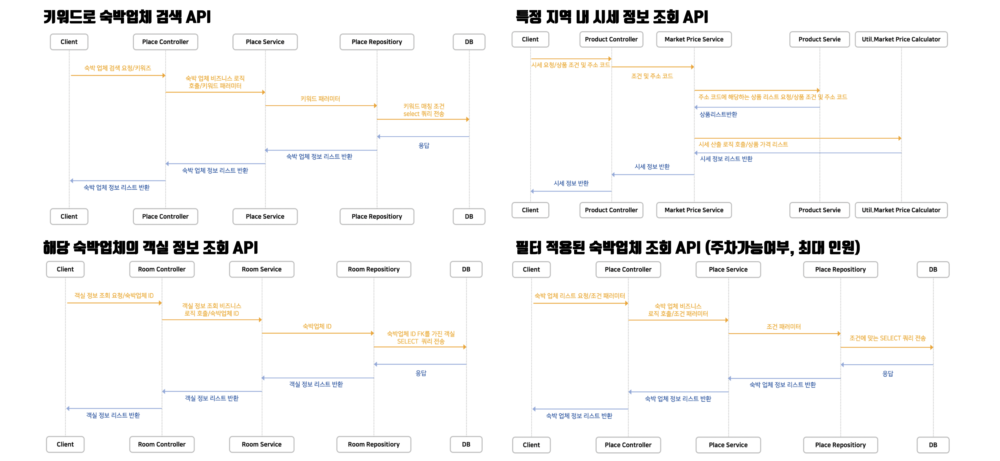

b# 🏨 풀방 BE

> 풀방은 AI를 기반으로 숙박 상품의 수요를 예측하고, 숙박 상품의 가격을 최적화시켜주는 플랫폼 서비스입니다.

풀방은 지역/유형/조건에 따라 숙박 상품의 시세를 제공하며, 위치 정보와 지도를 기반으로 숙박업체의 가격 정보를 확인할 수 있습니다.

또한, 숙박 상품 판매자에게는 다양한 변수를 고려하여 학습된 수요예측 AI를 기반으로 프로모션 가격을 책정하고 제안합니다.

[API Documentation](https://delphox60.notion.site/ad31f25345774e1b952ef944b75a911d?v=232e627e7b984d4e9f27e106c08fb53d&pvs=4)

---

## 🧑🏻‍💻 Service Architecture 👩🏻‍💻

## 📚 주요 기능 📚

1. 지역별, 숙박업종별 시세 제공
   - 지도 기반 지역별 숙박업체 시세 제공
   - 모텔, 호텔, 펜션, 게스트하우스 등 숙박업종별 시세 제공
2. 수요예측 Al 기반 프로모션 가격 책정 및 제안
   - 평일/주말/공휴일, 날씨(일평균 기온, 일평균 강수량), 성수기/비수기, 이전 공실률, 등 다양한 변수를 고려하여 수요예측 A 기반 공실률. 예측
   - 공실 프로모션 적정가 예측 및 제안
3. 프로모션 상품 정보 페이지 인터페이스 제공
   - 숙박업체에서 등록한 프로모션 상품 정보를 한 곳에 모은 정보 페이지 제공
   - 숙박업체 수요자가 프로모션 정보를 탐색할 수 있는 인터페이스 제공
   - 사용자가 링크를 통해 타 플랫폼에서 예약할 수 있도록 연계해주는 인터페이스 제공

### 🧩 Sequence Diagram 🧩

## ⚒️ 사용한 기술 ⚒️

- `Java`, `Spring Boot`
- `MariaDB`
- `AWS EC2`, `RDS`, `S3`
- `Swagger`
- `Python` (for Data Crawling)
